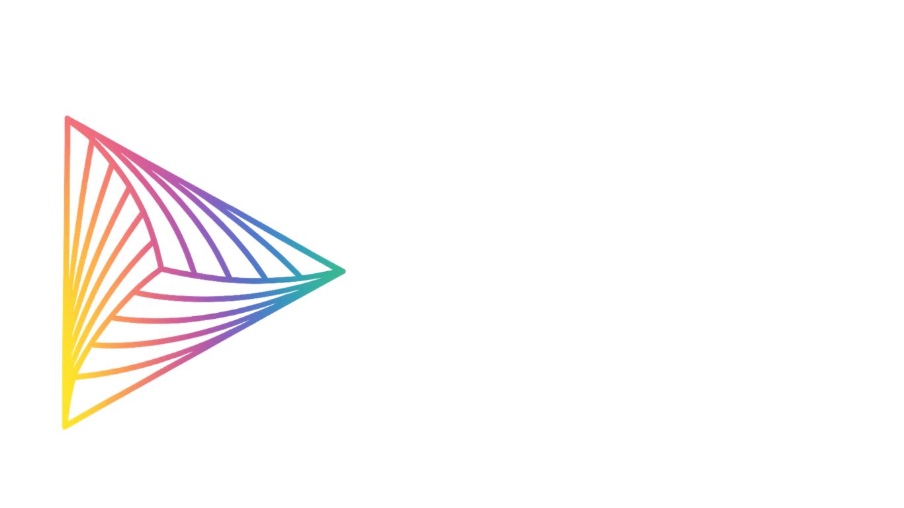
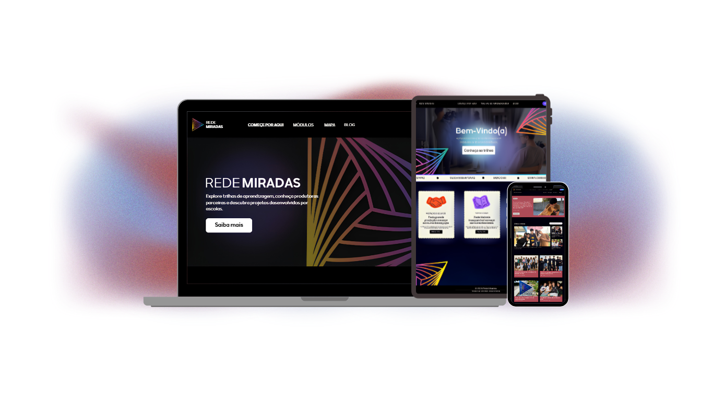

## Sobre o projeto

A **Rede Miradas** é uma plataforma digital desenvolvida para o **Projeto Miradas — Festival de Curtas-Metragens**, do IFRN Campus São Paulo do Potengi. O sistema tem como objetivo ampliar o acesso à aprendizagem e à produção audiovisual, reunindo em um único ambiente recursos voltados à formação, interação e divulgação do cinema produzido no contexto escolar.

A plataforma disponibiliza **trilhas de aprendizagem, conteúdos sobre produção audiovisual, fóruns de discussão, notícias e um mapa interativo de produtoras**, conectando estudantes, professores e profissionais do setor. O projeto busca fortalecer a educação audiovisual e facilitar o contato entre diferentes participantes da área, oferecendo recursos específicos de acordo com o perfil de cada usuário.

## Tecnologias Utilizadas

&nbsp;&nbsp;

&nbsp;&nbsp;

&nbsp;&nbsp;

&nbsp;&nbsp;

&nbsp;&nbsp;

&nbsp;&nbsp;

## Integrantes
• **[Ana Júlia Belchior](https://github.com/ajbelchior)** 
• **[Danielly Rodrigues](https://github.com/danybarreto2008)** 
• **[Hemerson Daniel](https://github.com/ohemesx)**

